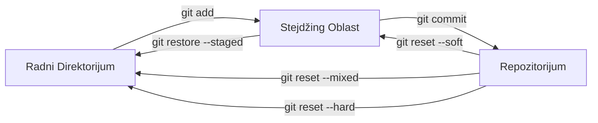

# Tri ključna stanja/prostora

<v-click>

Nakon `git init`, Git posmatra fajlove kroz tri osnovna stanja ili prostora:

</v-click>

<v-clicks>

- **Radni Direktorijum** (Working Directory) - Fajlovi koje vidimo i menjamo
- **Stejdžing Oblast** (Staging Area/Index) - Mesto gde pripremamo promene koje želimo da uključimo u sledeći 
  **snapshot** (commit)
- **Repozitorijum** (Repository) - Trajna baza podataka gde Git čuva sve *snapshot-ove* (commit-ove)

</v-clicks>

<v-click>

</v-click>