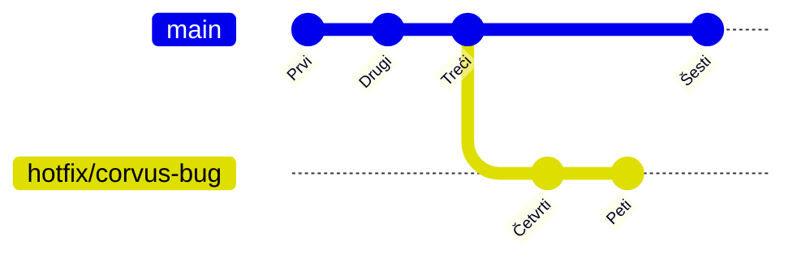

# Šta je grana?

<v-click>

Iako intuitivno zamišljamo granu kao kompletnu kopiju projekta, u Gitu je ona mnogo jednostavnija i efikasnija. 
Grana nije ništa drugo nego lagani, pokretni pokazivač (referenca/refs/pointer) koji ukazuje na jedan specifičan 
commit u istoriji projekta. Git interno upravlja ovim pokazivačima koristeći jednostavne fajlove unutar `.git/refs/` 
direktorijuma.

</v-click>

<v-clicks>

- **Pokazivač na commit:** Osnovna uloga grane je da "zapamti" određeni commit
- **Interno skladištenje:** Svaka grana se čuva kao fajl unutar `.git/refs/heads/`. 
Ime fajla odgovara imenu grane (npr. `.git/refs/heads/main`).
- **Sadržaj fajla:** Unutar tog fajla nalazi se samo 40-karakterni `SHA-1` heš commit-a na koji grana trenutno pokazuje.
- **Efikasnost:** Kreiranje nove grane je izuzetno brzo jer Git samo kreira novi fajl sa postojećim `SHA-1` hešom.
Commit-ovanje na grani samo ažurira `SHA-1` heš u tom fajlu.

</v-clicks>

