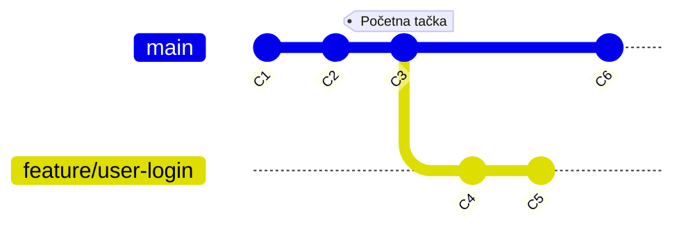

# Rad na granama

<v-click>

Lepota grananja leži u tome što omogućava da se istorija projekta prirodno razilazi (diverged branches). Kada pređete na novu 
granu i počnete da pravite nove commit-ove, te promene se beleže samo na toj grani, nezavisno od drugih grana koje 
možda postoje.

</v-click>

<v-clicks>

- **Nezavisne istorije:** Commit-ovi napravljeni na jednoj grani ne utiču direktno na druge grane.
- **Pomeranje pokazivača:** Kada napravite commit, Git automatski pomera pokazivač (fajl u `.git/refs/heads/`) **samo 
za granu na kojoj se trenutno nalazite** (onu na koju pokazuje `HEAD`) na novi commit.
- **`HEAD` prati granu:** Pošto je `HEAD` obično vezan za granu, on se takođe pomera zajedno sa njom na novi commit.
- **Razilaženje:** Ako se commit-ovi prave nezavisno na dve različite grane (npr. `main` i `feature-x`) koje su nekada 
delile zajedničkog pretka, njihove istorije počinju da se razlikuju.

</v-clicks>

