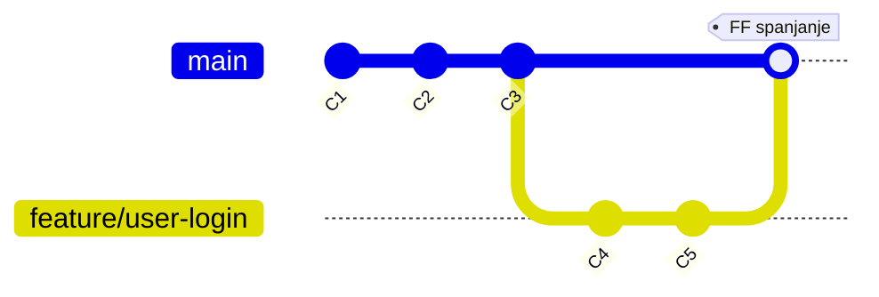

# Tipovi spajanja grana: Fast-Forward

<v-click>

Najjednostavniji scenario spajanja dešava se kada grana u koju spajate (target) nije imala nikakvih novih commit-ova od 
trenutka kada je grana koju spajate (source) kreirana iz nje. U ovom slučaju, istorija je i dalje linearna, a Git može 
izvršiti "brzo premotavanje".

</v-click>

<v-clicks>

- **Uslov:** Target grana (`main`) nema nove commit-ove koji nisu prisutni u source grani (`feature/user-login`).
Drugim rečima, `feature/user-login` je direktni naslednik `main`.
- **Git-ova akcija:** Nema potrebe za kreiranjem novog "merge commit-a". Git jednostavno pomera pokazivač target grane 
(`main`) unapred da pokazuje na isti commit kao i source grana (`feature/user-login`).
- **Rezultat:** Istorija ostaje linearna, kao da su svi commit-ovi napravljeni direktno na `main` grani. 
Spajanje je samo pomeranje pokazivača.

</v-clicks>

