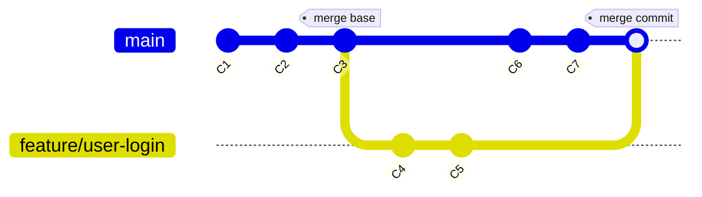

# Tipovi spajanja: Three-Way Merge

<v-click>

Kada su obe grane (i target i source) imale nezavisne promene (nove commit-ove) od trenutka kada su se razdvojile od 
zajedničkog commit-a, Git ne može jednostavno da pomeri pokazivač. Umesto toga, mora da izvrši kompleksnije spajanje 
poznato kao "three-way merge", koje uključuje kreiranje novog commit-a.

</v-click>

<v-clicks depth="2">

- **Uslov:** Obe grane (`main` i `feature/user-login`) imaju nove commit-ove od njihovog poslednjeg zajedničkog 
commit-a (merge base). Istorija se razilazi.
- **Git-ova akcija**:
    - Pronalazi poslednji zajednički commit (merge base) obe grane.
    - Pokušava da automatski spoji promene napravljene na obe grane od tog pretka.
    - Kreira **novi commit (merge commit)**. Ovaj commit je poseban jer ima **dva roditeljska commit-a**: poslednji 
    commit na target grani i poslednji commit na source grani.
- **Rezultat:** Merge commit integriše obe nezavisne linije razvoja. Istorija sada jasno pokazuje tačku spajanja.

</v-clicks>

