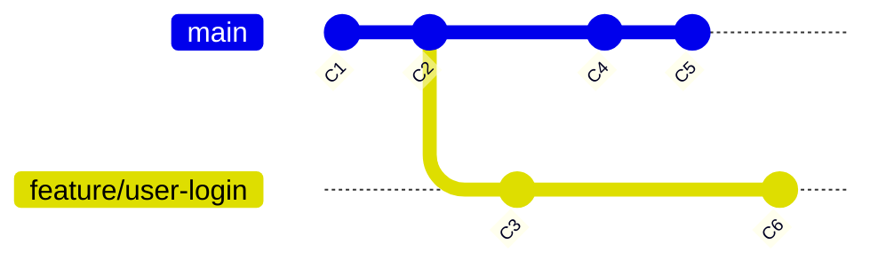

# Konflikti tokom `rebase`-a 2

<v-click>

<h2 style="margin-top: 0.5rem;">Konfliktni markeri i terminologija</h2>

```diff
\<<<<<<< HEAD (ours)
// Kod koji je već bio prisutan na novoj bazi
// (tj. verzija iz grane na koju radite rebase, npr. main)
// Ovo se tokom rebase-a naziva "naša" (ours) verzija.
Ovo je kod sa main grane (ili prethodno rebase-ovanih commit-ova).
=======
// Kod iz COMMIT-A KOJI SE TRENUTNO PRIMENJUJE
// (tj. verzija iz commit-a sa vaše grane, npr. feature/user-login)
// Ovo se tokom rebase-a naziva "njihova" (theirs) verzija.
Ovo je kod iz commit-a koji pravi konflikt sa feature/user-login.
>>>>>>> commit-hash... (theirs)
```

</v-click>

<v-clicks>

- **`ours` (rebase):** Verzija fajla sa **bazne grane** na koju radite rebase (npr. `main`).
- **`theirs` (rebase):** Verzija fajla iz **commit-a sa vaše grane** koji Git trenutno pokušava da primeni.

</v-clicks>

<div v-click style="text-align: center;">



</div>
